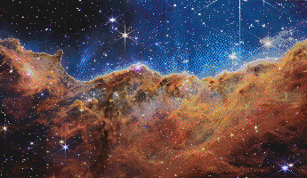

# factorio-blueprints

Converts images into pixel-art blueprints for the game [Factorio][factorio].

Table of Contents:

- [Example](#example)
- [Executable](#executable)
- [Blueprint Reference](#blueprint-reference)

## Example

Input image (taken by the James Webb Space Telescope, found [here][jw-link],
and used as per their [usage policy][jw-usage]):


Command to run:

```sh
$ cabal run blueprints -- \
    --image data/jw-orig.png \
    --preview data/jw-output.png \
    --height 200 \
    --set tile-dect \
    --dither atkin
```

Output Image:



As you may guess, this particular combination of input image and tileset
(`tile-dect`, the [Dectorio][dectorio] tileset) happen to work particularly
well together. This is because the colour palette of the original image was
well-covered by the specified tileset.

Results may not be so good when the tileset we are using is limited or is
missing any colours close to important ones that are present in large
amounts - there is a fundamental limit on how good our approximations can
be with limited and predefined colours available. Dithering certainly helps
to interpolate colours (as shown above, using Atkinson dithering
with `--dither atkin`), but if colours would need to be extrapolated that
can be a problem.

Below is also a snippet of the output JSON, for the curious. This is how the
blueprint is structured internally in-game. This output can be obtained by
adding `--output json` as an option on the command line, which will then
print this JSON to stdout.

```json
{
    "blueprint": {
        "item": "blueprint",
        "entities": [],
        "tiles": [
            {
                "name": "black-refined-concrete",
                "position": {
                    "x": 0,
                    "y": 0
                }
            },
            ...
        ]
    }
}
```

Additionally here is a snippet of the blueprint string after encoding, as
would be suitable for copy-pasting in-game. This can similarly be obtained by
adding `--output str` on the command line.

```
0eNqkvduyHbexbfsvfl6KKCQSt/UrJ/YDlzxlMY5FKijKOvaK...
```

## Executable

We provide an executable with a user-friendly interface, as shown below.
It can be invoked by running `cabal run blueprints` after downloading
this repository, and options can be provided after a double dash `--` as
shown in the [Example](#example) section above.

```
Usage:
  blueprints (-i|--image FILE)
             [-p|--preview FILE]
             [--set SET]
             [-o|--output FORMAT]
             [-d|--dither METHOD]
             [--width INT | --height INT | --scale FLOAT]

  Generate a Factorio Blueprint from a given image

Available options:
  -h,--help                Show this help text
  -i,--image FILE          the input image to use
  -p,--preview FILE        output a preview of the blueprint to the given file,
                           in PNG format
  --set SET                the tileset/palette to use - should be one of
                           {tile-base, tile-kras, tile-dect, all-base, all-kras}
  -o,--output FORMAT       print the blueprint in the given format - one of
                           {str, json}
  -d,--dither METHOD       how (if at all) to dither the preview image - one of
                           {fs, mae, atkin, none} (default: none)
  --width INT              target width (in pixels) to resize the image to
  --height INT             target height (in pixels) to resize the image to
  --scale FLOAT            ratio to scale the image to - scale=1 means preserve
                           size, scale=0.5 means half scale, etc.
```

## Blueprint Reference

How the blueprint format works in all technical details is explained
[here][wiki] on the official game wiki page.

[jw-link]: https://webbtelescope.org/contents/media/images/2022/031/01G77PKB8NKR7S8Z6HBXMYATGJ
[jw-usage]: https://webbtelescope.org/copyright
[wiki]: https://wiki.factorio.com/Blueprint_string_format
[dectorio]: https://mods.factorio.com/mod/Dectorio
[factorio]: https://factorio.com/
